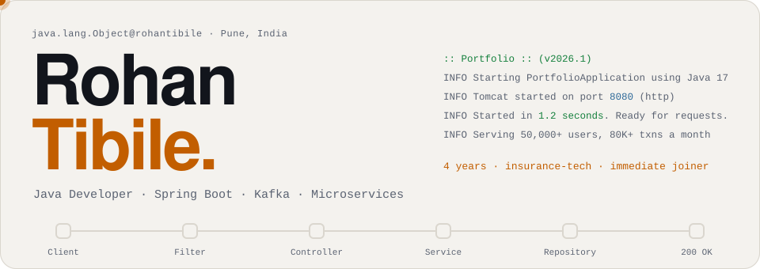
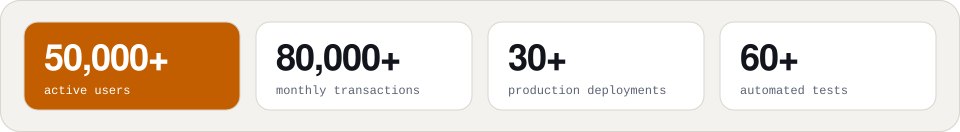
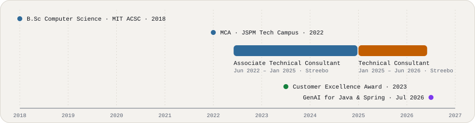

<div align="center">
  <picture>
    <source media="(prefers-color-scheme: dark)" srcset="assets/banner-dark.svg">
    
  </picture>
</div>

<p align="center">
  <a href="https://rohantibile.github.io"><b>Portfolio ↗</b></a> &nbsp;·&nbsp;
  <a href="https://www.linkedin.com/in/rohantibile">LinkedIn ↗</a> &nbsp;·&nbsp;
  <a href="mailto:tibilerohan3@gmail.com">Email ↗</a>
</p>

<br>

### `@Component` · Who is calling

`GET /api/developer` → `200 OK`

```json
{
  "name": "Rohan Tibile",
  "role": "Java Developer",
  "experience_years": 4,
  "domain": "High-transaction Insurance-tech",
  "location": "Pune, Maharashtra, India",
  "availability": "IMMEDIATE_JOINER",
  "currently_learning": ["Generative AI for Java & Spring"]
}
```

<picture>
  <source media="(prefers-color-scheme: dark)" srcset="assets/impact-dark.svg">
  
</picture>

<br>

### `@RestController` · Featured work

Client work at Streebo Pvt Ltd for Tata AIA Life Insurance. The source code is private, so the results below come from my resume.

| Route | What it is | Results |
|---|---|---|
| `GET /api/projects/agent-master` | · 3 Kafka-based microservices across 12–15 topics<br>· Java 17, Spring Boot, Apache kafka, event-driven microservices<br>· running agent compensation | · 40% faster cross-database sync<br>· hours down to 5–10 min<br>· 30% faster incident triage |
| `GET /api/projects/sellonline` |· TATA AIA Life Insurance: Web Development<br>· HTML, CSS and AngularJS interface<br>· Java 17, Spring Boot, microservices<br>· multi-step validation<br>· KYC auto-population<br>· Premium and sum-assured calculation engines on Spring Data JPA and Hibernat | · 50% fewer onboarding drop-offs<br>· over half of each profile auto-filled<br>· ~900 ms to ~600 ms policy workflows<br>· 60+ JUnit 5 and Mockito tests |

<br>

### `@Service` · Stack

```java
@Service
public class Rohan implements Developer {

  private final int experienceYears = 4;
  private final String domain = "High-transaction insurance-tech";

  @Autowired Language[]      languages  = { "Java 8 / 17", "JavaScript" };
  @Autowired Framework[]     frameworks = { "Spring Boot 3", "Spring Data JPA", "Hibernate" };
  @Autowired Messaging[]     bus        = { "ApacheKafka" };
  @Autowired Database[]      data       = { "PostgreSQL", "MySQL", "Azure Databricks" };
  @Autowired Observability[] watch      = { "Grafana", "Loki" };
  @Autowired Tool[]          tools      = { "Docker", "Jenkins", "Azure DevOps", "JUnit 5", "Mockito" };

  @Override
  public Result build(Problem p) {
    return p.design().implement().test().observe().ship();
  }

  public boolean isAvailable() { return true; } // immediate joiner
}
```

<br>

### `@Repository` · Experience

<picture>
  <source media="(prefers-color-scheme: dark)" srcset="assets/timeline-dark.svg">
  
</picture>

- **Technical Consultant (Full Stack Developer)**, Streebo Pvt Ltd · Jan 2025 – Jun 2026
- **Associate Technical Consultant (Full Stack Developer)**, Streebo Pvt Lts · Jun 2022 – Jan 2025
- **MCA**, JSPM Tech Campus, SPPU · 2022 &nbsp;|&nbsp; **B.Sc Computer Science**, MIT ACSC Alandi, SPPU · 2018
- **Generative AI for Java & Spring Developers**, IBM & SkillUp (Coursera) · Jul 2026
- **Customer Excellence Award** · 2023

<br>

### `200 OK` · Contact

<picture>
  <source media="(prefers-color-scheme: dark)" srcset="assets/response-dark.svg">
  
</picture>

<p align="center">
  <a href="https://rohantibile.github.io"><b>Portfolio ↗</b></a> &nbsp;·&nbsp;
  <a href="https://www.linkedin.com/in/rohantibile">LinkedIn ↗</a> &nbsp;·&nbsp;
  <a href="mailto:tibilerohan3@gmail.com">tibilerohan3@gmail.com</a>
</p>
